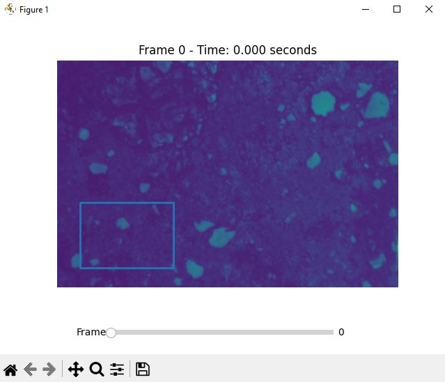
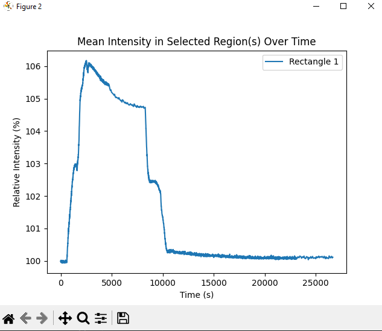
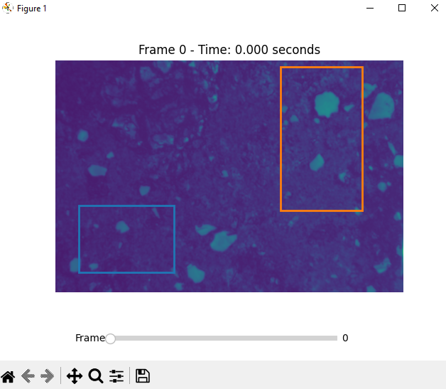
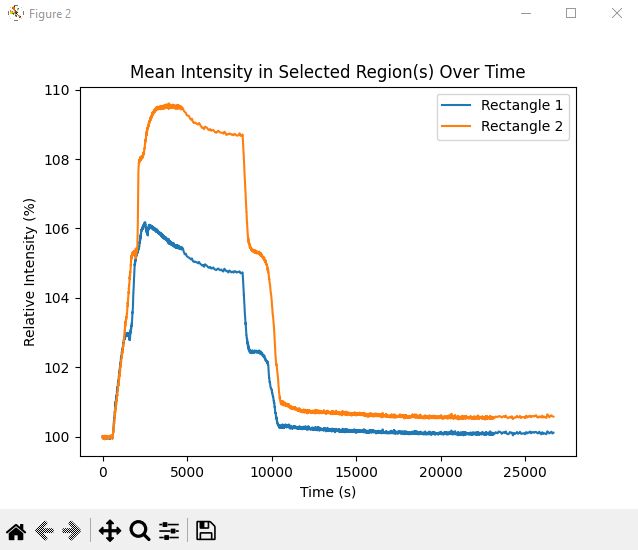

# Setup

1. This project uses python version 3.12.7 and the following libraries:
    - NumPy v2.1.3
    - MatPlotLib v3.9.2
    - PyTest v8.3.3

2. The 'movie.npy' and 'time.npy' files should be put in a folder called 'data' located in the project's root directory (`data/movie.npy`, `data/time.npy`). Create this folder if it does not exist.

3. To run the program, execute the main.py file from the project's root directory using `python -m core.main`

4. To run the pytests, use `pytest tests/` from the project's root directory

# Example of use
1. Open the tool using `python -m core.main`.
2. Visualise the movie by scrolling through the time axis with the slider at the bottom of the window.
3. Draw a rectangle on the image, this will open a second window with a graph of the mean intensity of the selected region across all frames.

 

4. Draw a second rectangle on the image, this will overlay a second plot on the figure in a different colour, matching the colour of the square drawn on the frame.

5. Close/stop the program by closing both windows.

# Limitations
- There are only 10 unique colours for rectangles/plots, so they will begin to cycle after they have all been used up. This will make the graphs less clear if many rectangles are drawn at the same time.
- There is no way to delete rectangles from the image/graph
- There is not much code coverage with the current test cases

These limitations are addressable given more time.

# Design Choices
- I have tried to modularise the code into classes, so that maintainability in adding/removing/modifying components is easier in the future.
- I thought overlaying the graphs on top of eachother - rather than new graphs for each rectangle - would provide a more simple and intuitive comparison of the relative intensities. This comes at a cost at potentially more cluttered graphs when many rectangles are drawn.
- I used numpy for many of the calculations made since it is generally much more efficient than vanilla python.